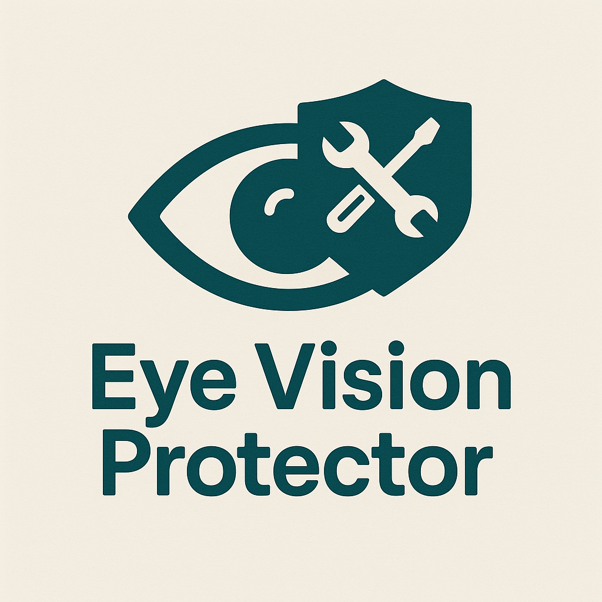

# 👁️ Eye Vision Protector - Better Vision & Save Your Vision

[](.)
[](./LICENSE)
[](https://chromewebstore.google.com/detail/eye-vision-protection-bet/ehcjdpbcpedjfhnmemneoahjglfnbcik)

<div align="center">
  
  <p><em>Comprehensive browser extension to protect your eyes and improve web accessibility</em></p>
</div>

---

## 🌟 What's New in v1.0.0

- **🔄 Fixed Dark Mode** - Now uses smart filter preserving images and videos
- **💙 Blue Light Filter** - Reduce eye strain with adjustable intensity
- **🎯 Focus Mode** - Dim distracting elements
- **📊 Usage Statistics** - Track your activity
- **🌐 Site Management** - Disable on specific websites
- **🎨 Modern UI** - Complete redesign with smooth animations

---

## 📑 Table of Contents

- [English](#english)
- [Русский](#русский)

---

## English

### 🚀 Key Features

#### 📝 Text Customization
- Font size adjustment (0 to +10 levels)
- 9 specialized fonts including OpenDyslexic
- Bold text mode for better readability

#### 🎨 Visual Settings
- **Smart Dark Mode**
  - Auto-switching by time (8 PM - 7 AM)
  - Adjustable intensity (50-100%)
  - Preserves images and videos
  
- **Blue Light Filter**
  - Reduces harmful blue light
  - Adjustable 0-100%
  
- **Color Blind Modes**
  - Protanopia, Deuteranopia, Tritanopia, Achromatopsia

#### ♿ Accessibility
- **Text-to-Speech** - Auto language detection
- **Text Magnifier** - Draggable zoom window
- **Focus Mode** - Highlight active elements

#### ⚙️ Advanced
- Custom CSS editor
- Site whitelist/blacklist
- Keyboard shortcuts
- Export/Import settings
- Usage statistics

### 📥 Installation

#### From Chrome Web Store
1. Visit [Chrome Web Store](https://chromewebstore.google.com/detail/eye-vision-protection-bet/ehcjdpbcpedjfhnmemneoahjglfnbcik)
2. Click "Add to Chrome"
3. Enjoy!

#### Manual Installation
```bash
git clone https://github.com/yourusername/eye-vision-protector.git
```
1. Open `chrome://extensions`
2. Enable "Developer mode"
3. Click "Load unpacked"
4. Select the extension folder

### 📖 Quick Start

1. Click extension icon
2. Adjust settings
3. Changes apply instantly

#### Keyboard Shortcuts
- `Ctrl+Shift+D` - Toggle dark mode
- `Ctrl+Shift++` - Increase font
- `Ctrl+Shift+-` - Decrease font

### 🔧 Technical

- **Browsers:** Chrome 88+, Edge 88+, Brave, Opera
- **Performance:** <1% CPU, ~10MB RAM
- **Privacy:** No data collection, all local

### ❓ FAQ

**Q: Does it slow down my browser?**  
A: No, highly optimized (<1% CPU).

**Q: Dark mode on all sites?**  
A: Yes, with smart filtering for images.

**Q: Is my data shared?**  
A: No, everything is local.

---

## Русский

### 🚀 Основные возможности

#### 📝 Настройка текста
- Размер шрифта (от 0 до +10 уровней)
- 9 специализированных шрифтов включая OpenDyslexic
- Режим жирного текста

#### 🎨 Визуальные настройки
- **Умная тёмная тема**
  - Автопереключение по времени (20:00 - 7:00)
  - Регулируемая интенсивность (50-100%)
  - Сохраняет изображения и видео
  
- **Фильтр синего света**
  - Снижает вредное излучение
  - Регулировка 0-100%
  
- **Режимы для дальтоников**
  - Протанопия, Дейтеранопия, Тританопия, Ахроматопсия

#### ♿ Доступность
- **Озвучивание текста** - Автоопределение языка
- **Лупа** - Перемещаемое окно увеличения
- **Режим фокуса** - Подсветка активных элементов

#### ⚙️ Продвинутые функции
- Редактор пользовательского CSS
- Управление списком сайтов
- Горячие клавиши
- Экспорт/Импорт настроек
- Статистика использования

### 📥 Установка

#### Из Chrome Web Store
1. Посетите [Chrome Web Store](https://chromewebstore.google.com/detail/eye-vision-protection-bet/ehcjdpbcpedjfhnmemneoahjglfnbcik)
2. Нажмите "Добавить в Chrome"
3. Наслаждайтесь!

#### Ручная установка
```bash
git clone https://github.com/yourusername/eye-vision-protector.git
```
1. Откройте `chrome://extensions`
2. Включите "Режим разработчика"
3. Нажмите "Загрузить распакованное расширение"
4. Выберите папку с расширением

### 📖 Быстрый старт

1. Нажмите на значок расширения
2. Настройте параметры
3. Изменения применяются мгновенно

#### Горячие клавиши
- `Ctrl+Shift+D` - Переключить тёмную тему
- `Ctrl+Shift++` - Увеличить шрифт
- `Ctrl+Shift+-` - Уменьшить шрифт

### 🔧 Технические характеристики

- **Браузеры:** Chrome 88+, Edge 88+, Brave, Opera
- **Производительность:** <1% CPU, ~10MB RAM
- **Конфиденциальность:** Нет сбора данных, всё локально

### ❓ Вопросы

**Q: Замедляет ли браузер?**  
A: Нет, высоко оптимизировано (<1% CPU).

**Q: Тёмная тема на всех сайтах?**  
A: Да, с умной фильтрацией изображений.

**Q: Передаются ли мои данные?**  
A: Нет, всё локально.

---

## 💝 Support / Поддержка

### ☕ Buy Me a Coffee
[buymeacoffee.com/aristarh.ucolov](https://buymeacoffee.com/aristarh.ucolov)

### 🏦 Bank Transfer / Банковский перевод
**Bank:** Moldindconbank  
**Card:** 4028 1202 1106 0963  
**Recipient:** Aristarh Ucolov

---

## 📄 License

GNU General Public License v3.0

---

<div align="center">
  <p>Made with ❤️ for better web accessibility</p>
  <p>© 2026 Eye Vision Protector</p>
</div>
